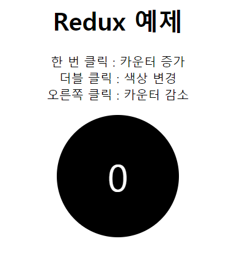

# redux 란?
**redux**는 JavaScript 어플리케이션에서 data-state와 UI-state를 관리해주는 도구이다.
상태적인 데이터 관리가 시간이 흐름에 따라 복잡해질 수도 있는 싱글페이지 어플리케이션에서 매우 유용하게 사용된다.

> redux를 사용하면 아래와 같은 데이터 관리를 할 수 있게 된다.

컴포넌트끼리 직접 교류하지 않고 **store**를 통하여 교류한다.
빨간 화살표 : store에 있는 데이터를 업데이트 한다.
주황 화살표 : 해당 컴포넌트에서 store에 있는 특정 데이터의 변동을 주의하고 있다가 변동이 있을 시 바로 반영시킨다.

## redux의 3가지 원칙
### Single Source of Truth
모든 state가 한 곳에 있기 때문에 이를 Single Source of Truth라고 부른다.

### State is read-only
어플리케이션에서 state를 직접 변경할 수 없다. state를 변경하기 위해서는 action이 dispatch되어야 한다. (action은 어떤 변화가 일어나야 할 지 알려주는 객체)

### Changes are made with Pure functions
action 객체를 처리하는 함수를 Reducer라고 부르는데, action은 어떤 변화가 일어나야 할 지 알려주는 객체라면, Reducer는 그 정보를 받고 애플리케이션의 상태를 어떻게 바꿀지 정의한다.

이미지 출처: https://velopert.com/1225

## redux react APP 예제
https://velopert.com/3346 를 참고하였습니다.
실행시 다음과 같은 화면이 나옵니다.

왼쪽 마우스를 한번 클릭하면 숫자가 증가하고, 오른쪽 마우스를 클릭하면 숫자가 감소하고, 더블클릭을 하면 원의 색상이 변경됩니다.
